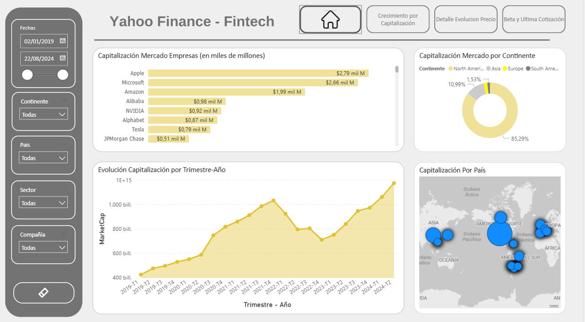

# 📊 Challenge BI/Data — Mercado Libre

Challenge técnico presentado en el proceso de selección para el equipo de **BI/Data de Mercado Libre**.  
Aprobado. Resultado: ingreso al equipo de Instore Payments como Data & Analytics Engineer.

---

## 🎯 Objetivo del Challenge

Analizar el comportamiento bursátil de las **100 principales compañías Fintech a nivel global**  
entre el **1 de enero de 2024** y el **22 de agosto de 2024**, con foco en:

- Tendencias de precios de acciones
- Volatilidad por empresa y sector
- Capitalización de mercado y comparación regional
- Evaluación de riesgo/retorno mediante indicadores financieros clave

---

## 🗂️ Dataset y Fuente de Datos

Los datos fueron extraídos programáticamente desde la **API de Yahoo Finance** usando Python (`yfinance`).

El script recopila para cada empresa:
- Precios históricos de cierre ajustados
- Capitalización de mercado
- Ratio P/E (Precio/Ganancias)
- Beta (volatilidad relativa al mercado)
- Rendimiento por dividendos

Los datos se procesan con `pandas` y se exportan a `.CSV` para su análisis en Power BI y Tableau.

> ⚠️ Nota: 9 de las 100 empresas no tenían datos disponibles en Yahoo Finance. El análisis se realizó sobre **91 compañías**.

---

## 🛠️ Stack Tecnológico

| Herramienta | Uso |
|---|---|
| Python (`yfinance`, `pandas`) | Extracción y transformación de datos vía API |
| VSCode | Ejecución del script |
| Power BI | Dashboard principal |
| Tableau | Dashboard alternativo |

---

## 📐 Indicadores Analizados

**Capitalización de Mercado** — Valor total de las acciones en circulación. Indicador de tamaño y estabilidad relativa de cada empresa.

**Beta** — Medida de volatilidad respecto al mercado general. Beta > 1 implica mayor riesgo; Beta < 1, menor.

**PE Ratio** — Relación precio/ganancias por acción. Permite evaluar si una acción está sobre o infravalorada.

**Precio de Cierre** — Referencia diaria para análisis de tendencia y comparaciones históricas.

---

## 💡 Principales Insights

### 🌎 Concentración geográfica
Norteamérica y Asia concentran la mayor parte de la capitalización de mercado global.  
**Sudamérica representa solo el 1.53% del Market Cap total** dentro de las 100 Fintech analizadas.  
Brasil lidera en la región (puesto 5°), Argentina ocupa el 8° lugar, con MercadoLibre como principal representante.

### 📈 Crecimiento de capitalización
MercadoLibre registró un **crecimiento del 210%** en capitalización de mercado en el período completo analizado,  
posicionándose como el caso de expansión más destacado de Sudamérica.

### 💹 Precio de acciones
NVIDIA fue la compañía con mayor crecimiento de cotización: **+3.500%** en el período.  
A nivel sudamericano, MercadoLibre lideró con un **crecimiento del +550%** en el precio de sus acciones.

### ⚠️ Riesgo y volatilidad
La mayoría de las empresas presentan un Beta moderado.  
Sin embargo, algunas superan el valor de **2.0**, señalando un riesgo significativamente mayor que el mercado.

---

## 🧠 Conclusiones

- **Dominio tecnológico:** El sector tech lidera en capitalización y crecimiento, con tendencia de expansión continua.
- **Brecha regional:** La concentración en Norteamérica y Asia contrasta con la participación marginal de Sudamérica, aunque con jugadores de alto crecimiento como MercadoLibre.
- **Riesgo/Retorno:** Los indicadores Beta y dividendos permiten distinguir perfiles de inversión muy diferentes dentro del mismo sector Fintech.
- **Open Finance como ventaja competitiva:** La transparencia de datos financieros se consolida como factor diferenciador en el ecosistema Fintech post-pandemia.

---

## 📁 Archivos del repositorio

| Archivo | Descripción |
|---|---|
| `ApiYahooFinance_Meli.ipynb` | Script Python para extracción de datos desde Yahoo Finance |
| `Challenge Meli.pbix` | Dashboard en Power BI |
| `Presentación Challenge Meli BI Data - Bouzada Diego.pdf` | Presentación ejecutiva del análisis completo |

---

## 👨‍💻 Autor

**Diego Bouzada** — Data & Analytics Engineer  

